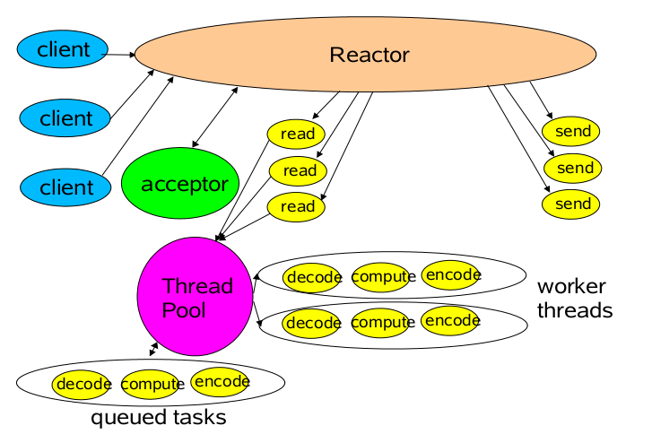

#NIO
参考[美团技术团队](https://tech.meituan.com/2016/11/04/nio.html)


`Non-blocking I/O 是一种非阻塞的 IO 模型, 是解决高并发场景问题的一种方式.`

那么我们从传统 IO 和线程池模型面临的问题开始, 逐渐解析 NIO 怎么利用 **事件** 模型来处理的, 包括面向事件的方式编写服务端/客户端程序

我们通过伪代码来描述一下传统的 同步阻塞 IO 模型:

```
ServerSocket serverSocket = new ServerSocket().bind(8080);
ExecutorService executor = Excutors.newFixedThreadPollExecutor(100);//线程池
while(!Thread.currentThread.isInturrupted()){//主线程死循环等待新连接到来
    Socket socket = serverSocket.accept();
    executor.submit(new Handler(socket));//为新的连接创建新的线程
}
class Handler extends Thread {
    private Socket socket;
    public ConnectIOnHandler(Socket socket){
       this.socket = socket;
    }
    public void run(){
        while(!Thread.currentThread.isInturrupted()&&!socket.isClosed()){
            String someThing = socket.read()....//读取数据
            if(someThing!=null){
                ......//处理数据
                socket.write()....//写数据
            }
        }
    }
}
```
之所以使用多线程, 是因为每个线程在处理 socket.accept()、socket.read()、socket.write() 这三个主要函数都是同步阻塞的, BIO 没有能力知道 到底能不能读/写, 所以全程"傻等", 只能用多线程强行把 CPU 释放出来.

`其实这也是所有多线程的本质, 1.利用多核; 2.当 IO 阻塞系统时, 使用多线程占用 CPU 资源.`

不过, 这个模型最本质的问题在于, 严重依赖线程. 依赖线程怎么了? 线程有什么特点? 线程是很"贵"的资源,
那么线程贵在哪?
1. 线程的创建和销毁成本高, 如果我们的 IO 处理过程不是一个 java 进程, 而是 Linux 操作系统, 线程本质就是进程, 创建和销毁都是重量级的系统函数.
2. 线程占用较大的内存, 在 jdk1.5 之后, 每个线程占用 1M 的内存空间.
3. 线程切换成本很高, 因为线程切换还需要保留线程的上下文, 如果线程数过高, 可能执行线程切换的时间甚至大于线程执行的时间.

NIO 的读写函数的关键是可以**立刻返回**; 一个连接不能读写时做个记录: 在 Selector 上注册标记位, 然后切换到其他就绪的链接(channel)继续进行读写;

NIO 的重要事件有几个: 读就绪, 写就绪, 有新连接到来. 好, 我们来看具体的流程, 这个流程了解了, 就知道 NIO 的核心了:
```
interface ChannelHandler {
    void channelReadable(Channel channel);
    void channelWritable(Channel channel);
}
class Channel {
    Socket socket;
    Event event;//读，写或者连接
}
class IoThread extends Thread {
   Map<Channel，ChannelHandler> handlerMap; //channel 对应的 handler
    public void run() {
        Channel channel;
        while(channel=Selector.select()) {//选择就绪的事件和对应的连接
            if(channel.event==accept) registerNewChannelHandler(channel);//如果是新连接，则注册一个新的读写处理器
            if(channel.event==write) handlerMap.get(channel).channelWritable(channel);//如果可以写，则执行写事件 
            if(channel.event==read) handlerMap.get(channel).channelReadable(channel);//如果可以读，则执行读事件
        }
   }
}
```
这就是最简单的 Reactor 模型: 注册所有感兴趣的时间处理器, 单线程轮训选择就绪事件, 执行事件处理器.

那如果把这个过程改造成多线程的呢? 我们来分析下我们都需要哪些线程: 
1. 事件分发器, 选择就绪的时间.
2. IO 处理器, 包括: connect/read/write, 这个处理器是一个纯粹的 CPU 的操作, 一般为 CPU 的核心线程数就可以.
3. 业务过程, 在处理 IO 后, 业务一般还有自己的业务逻辑, 这些业务逻辑有可能是阻塞的, 所以只要是阻塞, 我们就开线程.



以上是 NIO 服务端的架构, 那么客户端在 NIO 场景下有什么优化呢? 常见的客户端以: BIO + 连接池模型, 建立起 n 个连接, 然后当某一个连接被 IO 占用时, 可以使用其他连接来提高性能.

但是多线程的模型和服务端也面临同样的问题, 如果只是增加连接数来提高性能, 那么线程的开销同样增加, 也就是性能遇到瓶颈.

对于 Redis 来说, 由于是 Redis 是串行的, 能够保证同一连接的所有请求与返回顺序一致, 这样可以使用单线程+队列, 把请求数据缓存, 然后 pipeline 发送, 返回 future, 然后 channel 可读时, 直接把队列中的 future 取回来

最后总结一下 NIO 的特点:
* 事件驱动模型
* 避免多线程
* 单线程处理多任务
* 读写不阻塞
* 高级 IO 函数, zero-copy
* IO 多路复用