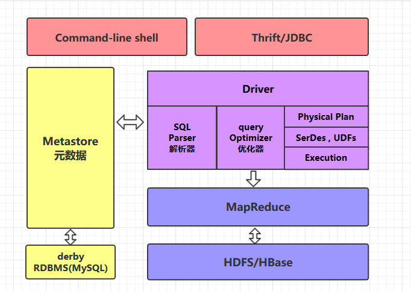

##了解 Hive
###Hive 简介及核心概念
####一. 简介
* * *
Hive 是建立在 Hadoop 之上的数据仓库, 可以将结构化的数据文件映射成表, 并提供 hive-SQL 进行查询 插入等操作.  
hive-SQL 会将查询转化为 MapReduce 作业, 然后提交到 Hadoop 上运行.  
**特点**  
1.简单, 提供类似 sql 语法, hive 将完成 sql -> mapReduce 的过程.
2.灵活, 用户可以自定义 UDF 函数, 辅助查询过程.  
3.for big data, 集群容易拓展.  
4.提供统一的元数据管理, metaStore, 目前各个查询工具也在基于 metaStore 进行查询, presto/sparksql...  
5.查询延迟高.

####二.Hive 架构
* * *

**组件说明**
1. command-line shell & thrift/jdbc:  
   * 提供命令行的形式完成 hive 操作
   * thrift 协议的标准 JDBC 的方式操作
2. metaStore:  
Hive 中, 表名 表结构 字段名 字段类型 表备注 表的分隔符等统一被称为元数据. 这些元数据默认存储在 Hive 内置的 derby 数据库.  
但事实上, 大多数的用户都使用 MySQL TiDB 来替换到 derby.
3. HQL 的执行流程:
   1. 语法解析: 先把 SQL 转化为 抽象语法树 AST Tree;
   2. 语义解析: 遍历 AST Tree, 抽象出查询的基本组成单元 QueryBlock;
   3. 生成逻辑执行计划: 遍历 QueryBlock, 翻译为操作树 OperatorTree;
   4. 优化逻辑执行计划: 优化 OperatorTree, 减少 shuffle 数据量;
   5. 生成物理执行计划: 遍历 OperatorTree, 翻译为 MapReduce 任务;
   6. 优化物理执行计划: 生成最终的执行计划;  
      总结: SQL -> AST Tree -> QueryBlock -> OperatorTree -> MapReduce.

####三.数据类型
* * *
略过...不适合把官网的信息再抄一遍
####四.存储格式
* * *
* TextFile: 默认, 无压缩, 磁盘开销大, 数据解析开销大.
* SequenceFile:  
* RCFile: 
* ORC Files: RCFile 的拓展, 比较主流
* Avro Files: 
* Parquet: 列存格式, 按列进行压缩和编码, 降低空间提高 IO
####五.内部表与外部表
* * *
首先, 这个内部是相较于 hive 的内部 或者 外部, 默认都是内部表. 
* 内部表
  * 数据存储位置: hive 自己管理存储位置
  * 导入数据: 会将数据移动到自己的目录下, 生命周期由 hive 管理
  * 删除表: 删除数据与表
* 外部表
  * 数据存储位置: 额外指定 location
  * 导入数据: 外部表不会把数据移动到自己的目录下, 而是在元数据中保存了数据的位置
  * 删除表: 删除表的元数据