# [calcite](https://calcite.apache.org/)

`The foundation for your next high-performance database.`

1. Standard SQL: 行业通用的 SQL 解析 与 验证.
2. Query optimization: 以关系代数表示 **查询**(仅仅是查询, 不包含 insert 什么的), 基于 RBO 和 CBO 两种规则对关系表达式进行优化.
3. Any data, anywhere: 连接第三方数据源, 元数据.

# 一.calcite 的意义
`calcite 对我有什么意义? 流行在哪? `
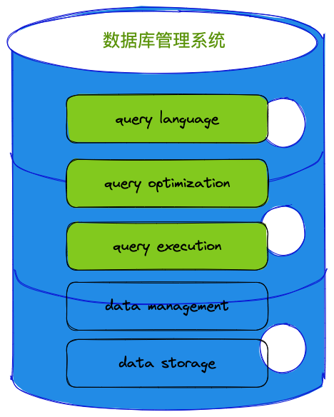

在一般的数据库管理系统中, 涉及这 5 个模块, calcite 专注于绿色的 3 个模块.

# 二.处理流程
`calcite 如何贯穿了整个查询过程?`


1. 解析 SQL, 把 SQL 转换成为 AST(抽象语法树), 在 Calcite 中用 SqlNode 来表示;
2. 语法检查, 根据数据库的元数据信息进行语法验证, 验证之后还是用 SqlNode 表示 AST 语法树;
3. 语义分析, 根据 SqlNode 及元信息构建 RelNode 树, 也就是最初版本的逻辑计划(Logical Plan);
4. 逻辑计划优化, 优化器的核心, 根据前面生成的逻辑计划按照相应的规则(Rule)进行优化;
5. 物理执行.

注: 在这里可能大家对于 SqlNode RelNode LogicalPlan 或者 什么是 Rule 可能都不清楚, 没关系, 往下继续看, [第六章](../calcite/calcite.md#61-语义分析)会解释这些的.

Demo 基于 1.18.0 [DOC](https://javadoc.io/doc/org.apache.calcite/calcite-core/1.18.0/overview-summary.html)

# 三.Parser

`Calcite 使用 javacc 做 语义 词义 解析.`

## 3.1 javacc

[javacc](https://javacc.github.io/javacc/): `Java Compiler Compiler (JavaCC) is the most popular parser generator for use with Java applications.`

javacc 是一个 语法词法 解析器的生成器, 是个 **生成器**, 生成完整的一套解析工具, 解析过程的本质也是利用 正则.

* 语法解析: parsing
* 词法解析: 
  * 将每一个字符串解析成一个个标识符(Token)
  * 例: c 语言解析成 token 

以一个四则运算表达式为例, 了解 javacc 如何参与到解析过程


1. 看看四则运算表达式的 [Calculator.jj](./javacc/Calculator.jj) 文件;
   1. jj 文件的编写过程是思路的实现, 画清楚 **语法树** 是帮助理清思路的重要方法.
2. ```javacc xx.jj```
3. 生成工具类 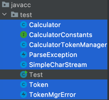
4. 四则运算计算器使用[入口](./javacc/test/JavaccTest.java)

有了四则运算的例子, 可以深入了解 calcite 的 [Parser.jj](https://github.com/apache/calcite/blob/master/core/src/main/codegen/templates/Parser.jj)

## 3.2 calcite 的 parser 过程

```java
public class Test {
    public static SqlNode parse(String sql) {
        SqlParser parser = SqlParser.create(sql, SqlParser.Config.DEFAULT);
        return parser.parseStmt();
    }

    public static void main(String[] args) {
        SqlNode sqlNode = Test.parse("");
        System.out.println(sqlNode.toString());
        // accept 访问者模式
        sqlNode.accept(SqlVisitor < R > visitor);
    }
}
```

以 [CalciteUtils](./utils/CalciteUtils.java)._parse()_ 为例

解析过程: 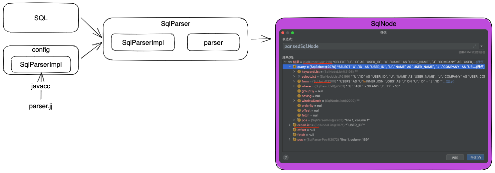

解析结果: 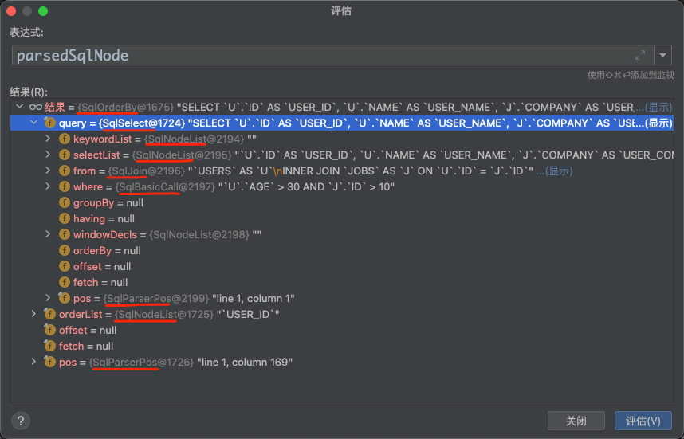

结合 [Visitor](./visitor/Visitor.java)([访问者](../../../../mark/设计模式.md)设计模式) 可以获取到这样的结果: 

# 四.Validate

通过上面的 Parser 过程会生成一个 SqlNode 对象, 接下来对它进行语法检查阶段, 语法检查的前提就是元数据(表名, 字段名, 字段类型, 函数名...)

结合 [calcite java doc - 1.18.0](https://javadoc.io/doc/org.apache.calcite/calcite-core/1.18.0/overview-summary.html) 
与我们的调用代码 [CalciteUtils](./utils/CalciteUtils.java)._validate()_ 看一次验证的过程

通过验证器的构造函数, 发现 SqlNode 验证的就是 SQL 运算符(函数)/catalog/数据类型/SQL 兼容模式

验证过程: 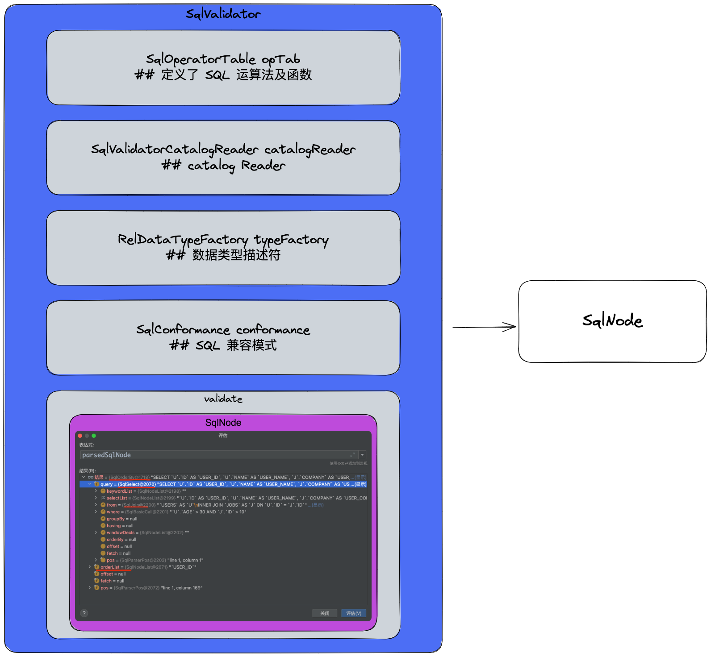

验证结果: 特意写错字段名字测试一下 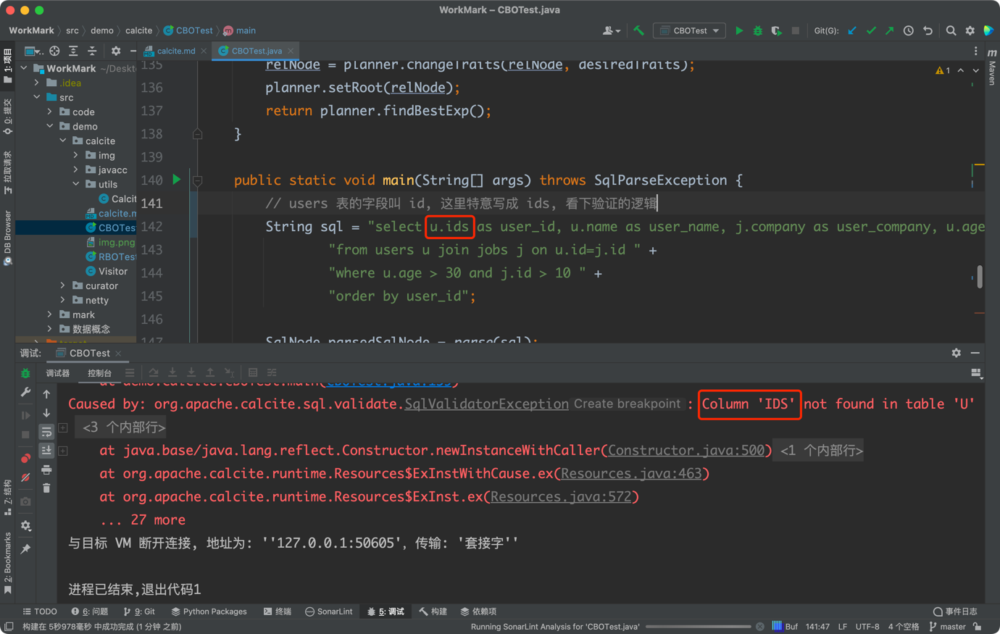

# 五.Parser & Validate 总结:

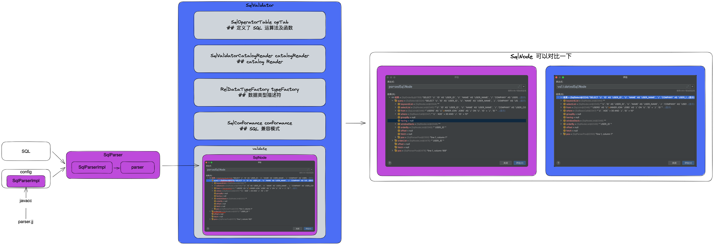

# 六.Optimize

关于优化我们直接查看代码: [**RBOTest**](./run/RBOTest.java)._rBoRelNodeFindBestExp()_.

这其中最关键的一行: planner.findBestExp() 是怎么完成优化的呢? 

`Finds the most efficient expression to implement the query given via RelOptPlanner.setRoot(org.apache.calcite.rel.RelNode).`

也就是优化器我们指定 root 一个 RelNode 便可以寻找最高效解析器了.

这一部分中我们需要两个对象, 
1. [**RelNode**](https://javadoc.io/doc/org.apache.calcite/calcite-core/1.18.0/org/apache/calcite/rel/RelNode.html)
2. [**Planner**](https://javadoc.io/static/org.apache.calcite/calcite-core/1.18.0/org/apache/calcite/plan/RelOptPlanner.html)

对应的问题:
* Q1: 那么 RelNode 是什么? 在上一 part 中, 我们都是对 SqlNode 进行操作(Parser/Validate), 现在我该如何提供 RelNode? SqlNode 是否可以又是如何转换为 RelNode? 
* Q2: 如何创建一个 Planner? Planner 是如何 findBestExp() 的? 

## 6.1 语义分析
`这里专门解释上面的 Q1`

那么是如何完成转换的过程? 通过[搜索](https://www.google.com/search?q=sqlnode+relnode+calcite) 我们可以找到这样的文档: 

[SqlToRelConverter](https://javadoc.io/doc/org.apache.calcite/calcite-core/1.18.0/org/apache/calcite/sql2rel/SqlToRelConverter.html):
Converts a SQL parse tree (consisting of SqlNode objects) into a relational algebra expression (consisting of RelNode objects).

* SqlNode: A SqlNode is a SQL parse tree.
* RelNode: A RelNode is a relational expression.
* RexNode: Row expression.

注: 这里正好解释了[第二章](../calcite/calcite.md#二处理流程)留下的坑

SqlNode -> RelNode/RexNode, 这步我们称为语义分析, 也是生成逻辑计划(Logical Plan)的过程.

结合 [**CalciteUtils**](./utils/CalciteUtils.java)._sQLNode2RelNode()_ 我们来看 SqlNode -> RelNode 的过程.

1. org.apache.calcite.sql2rel.SqlToRelConverter.convertQuery: Converts an unvalidated query's parse tree into a relational expression.
2. org.apache.calcite.sql2rel.SqlToRelConverter.convertQueryRecursive: Recursively converts a query to a relational expression.
3. org.apache.calcite.sql2rel.SqlToRelConverter.convertSelect: Converts a SELECT statement's parse tree into a relational expression.
4. org.apache.calcite.sql2rel.SqlToRelConverter.convertSelectImpl: 真正实现 convertSelect, 逐渐执行:
   1. convertFrom
   2. convertWhere
   3. convertSelectList
   4. ... ...
5. 上面执行的这些 convertXXX 操作就是在生成 LogicalProject 逻辑计划 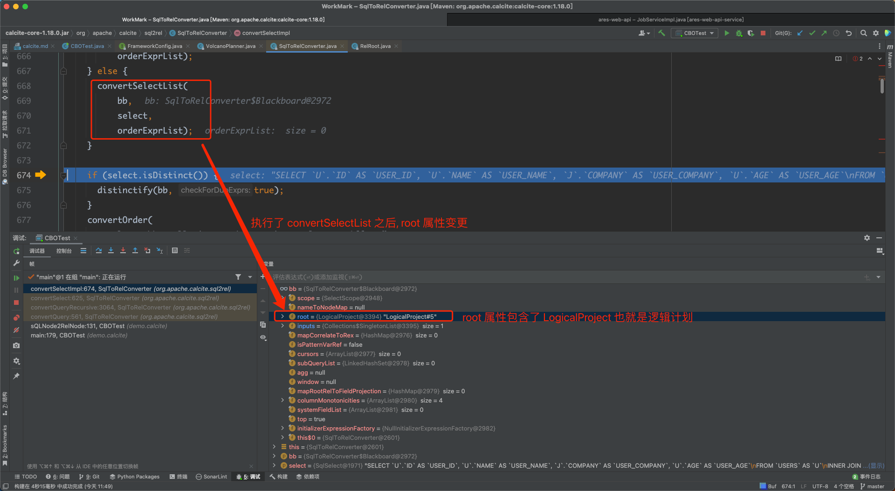
6. 最终我们生成的 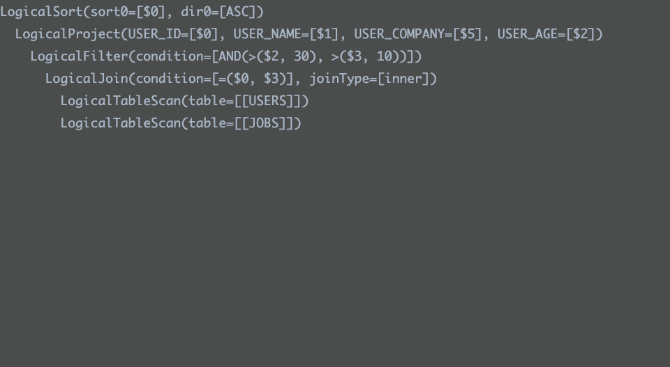

## 6.2 优化器(Planner)的实现

`这里专门解释上面的 Q2`

所谓的优化, 其根本是: 关系代数


`
关系代数是关系型数据库操作的理论基础, 同样也是 calcite 优化模块的核心, 我们常说的 SQL 也仅仅是关系代数运算的一种常用的实现方式而已(并不是唯一方式);
在 calcite 中会将 SQL 转换成关系表达式, 然后通过规则匹配对关系表达式进行优化. 也是一个分层思想的体现.
`

关系代数常用的对集合的操作:

SQL -> 关系代数 -> 优化关系表达式

* 基于规则的优化(Rule-Based Optimizer，RBO)
    * 根据优化规则对关系表达式进行转换, 这里的转换是说一个关系表达式经过优化规则后会变成另外一个关系表达式, 同时原有表达式会被裁剪掉, 经过一系列转换后生成最终的执行计划.
    * RBO 的实现: HepPlanner
* 基于成本的优化(Cost-Based Optimizer，CBO)
    * CBO 的实现: VolcanoPlanner

更详细的对于 CBO & RBO: 点击此 [**文章**](http://hbasefly.com/2017/05/04/bigdata%EF%BC%8Dcbo/). 

无论 RBO or CBO, 都遵循着同样地优化准则:

1. 谓词下推 Predicate Pushdown: 提前 filter 减少数据量 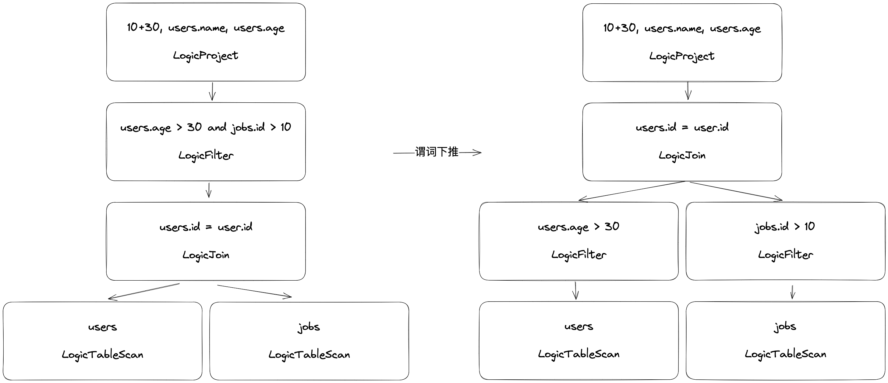
2. 常量折叠 Constant Folding: 
3. 列裁剪 Column Pruning: 只保留需要列减少计算带来的消耗 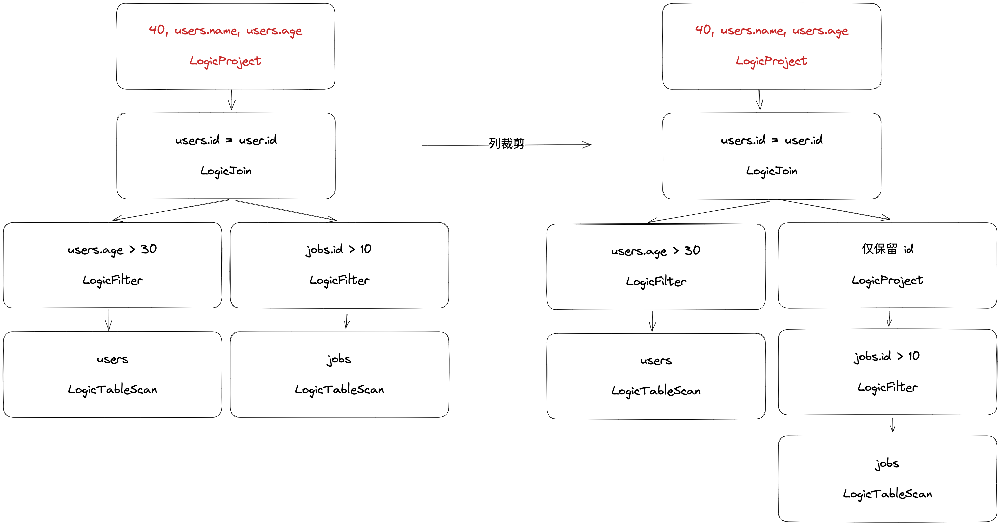
4. 其他

知道了优化根本, 我们具体去看 calcite 中两个优化器: HepPlanner / VolcanoPlanner 的具体实现

结构与继承关系: 

## 6.3 HepPlanner

官方的测试类 [HepPlannerTest](https://github.com/apache/calcite/blob/f0c6cd5a52cfd954dd89fe7a2a422fe6e60ed28e/core/src/test/java/org/apache/calcite/test/HepPlannerTest.java)

以 [RBOTest](./run/RBOTest.java)._rBoRelNodeFindBestExp()_ 入口, 追踪源码看下:
* org.apache.calcite.plan.hep.HepPlanner.setRoot: 构建图, 这个图是什么呢? 就是上面的 RelNode 转换成了 图 这种结构.
* org.apache.calcite.plan.hep.HepPlanner.findBestExp: 优化开始
  * org.apache.calcite.plan.hep.HepPlanner.executeProgram: 遍历 [HepProgram](https://javadoc.io/static/org.apache.calcite/calcite-core/1.18.0/org/apache/calcite/plan/hep/HepProgram.html) 中指定的规则
    * org.apache.calcite.plan.hep.HepPlanner.executeInstruction(org.apache.calcite.plan.hep.HepInstruction.RuleInstance)
      * org.apache.calcite.plan.hep.HepPlanner.applyRules
        * org.apache.calcite.plan.hep.HepPlanner.applyRule
  * org.apache.calcite.plan.hep.HepPlanner.collectGarbage: 垃圾收集, 不跟踪
  * org.apache.calcite.plan.hep.HepPlanner.buildFinalPlan: 构建最终计划, 都是 new 过程

```java
/**
 * RBO 实现器 HepPlanner 的实现过程
 */
public class HepPlanner extends AbstractRelOptPlanner {

    private void executeProgram(HepProgram program) {
        HepProgram savedProgram = currentProgram;
        currentProgram = program;
        currentProgram.initialize(program == mainProgram);
        // 遍历的就是: 我们创建优化器时指定的规则
        // 参考创建优化器代码: main.java.demo.calcite.run.RBOTest.createHepPlanner
        for (HepInstruction instruction : currentProgram.instructions) {
            instruction.execute(this);
            // 这里为了专注重要方法省略了些其他代码, 大家有兴趣自己查看源码
            // ...
        }
    }

    // 因为我们在 hepProgramBuilder.addRuleInstance 创建的都是 HepInstruction.RuleInstance 类型规则, 所以执行优化的过程进入到这个方法
    void executeInstruction(HepInstruction.RuleInstance instruction) {
        if (skippingGroup()) {
            return;
        }
        if (instruction.rule == null) {
            assert instruction.ruleDescription != null;
            instruction.rule = getRuleByDescription(instruction.ruleDescription);
            LOGGER.trace("Looking up rule with description {}, found {}", instruction.ruleDescription, instruction.rule);
        }
        if (instruction.rule != null) {
            // 重点
            applyRules(Collections.singleton(instruction.rule), true);
        }
    }

    /**
     * 开始真正的将 规则(rule) 与 逻辑计划中的每个点 结合.
     * @param rules 规则
     * @param forceConversions true
     */
    private void applyRules(Collection<RelOptRule> rules, boolean forceConversions) {
        if (currentProgram.group != null) {
            assert currentProgram.group.collecting;
            currentProgram.group.ruleSet.addAll(rules);
            return;
        }
        LOGGER.trace("Applying rule set {}", rules);
        boolean fullRestartAfterTransformation = currentProgram.matchOrder != HepMatchOrder.ARBITRARY && currentProgram.matchOrder != HepMatchOrder.DEPTH_FIRST;
        int nMatches = 0;
        boolean fixedPoint;
        do { // 开始递归
            Iterator<HepRelVertex> iter = getGraphIterator(root);
            fixedPoint = true;
            while (iter.hasNext()) {
                // 图中的点, 也就是我们的 逻辑计划
                HepRelVertex vertex = iter.next();
                // 开始真正拿到我们的 rule
                for (RelOptRule rule : rules) {
                    // 这里生成了新的点, 入参是: 旧的点(逻辑计划) × 规则 × 入参传递的(true)
                    HepRelVertex newVertex = applyRule(rule, vertex, forceConversions);
                    // 下面是一些退出条件了, 暂时先不追踪了
                    if (newVertex == null || newVertex == vertex) continue;
                    ++nMatches;
                    if (nMatches >= currentProgram.matchLimit) return;
                    if (fullRestartAfterTransformation) {
                        iter = getGraphIterator(root);
                    } else {
                        // To the extent possible, pick up where we left off; have to create a new iterator because old one was invalidated by transformation.
                        iter = getGraphIterator(newVertex);
                        if (currentProgram.matchOrder == HepMatchOrder.DEPTH_FIRST) {
                            nMatches = depthFirstApply(iter, rules, forceConversions, nMatches);
                            if (nMatches >= currentProgram.matchLimit) return;
                        }
                        // Remember to go around again since we're skipping some stuff.
                        fixedPoint = false;
                    }
                    break;
                }
            }
        } while (!fixedPoint);
    }

    /**
     * 旧的逻辑计划与规则生成新的逻辑计划
     * @param rule 规则 
     * @param vertex 关系表达式
     * @param forceConversions true
     * @return 优化过的关系表达式
     */
    private HepRelVertex applyRule(RelOptRule rule, HepRelVertex vertex, boolean forceConversions) {
        if (!belongsToDag(vertex)) return null;
        RelTrait parentTrait = null;
        List<RelNode> parents = null;
        if (rule instanceof ConverterRule) {
            // Guaranteed converter rules require special casing to make sure they only fire where actually needed, otherwise they tend to fire to infinity and beyond.
            ConverterRule converterRule = (ConverterRule) rule;
            if (converterRule.isGuaranteed() || !forceConversions) {
                if (!doesConverterApply(converterRule, vertex)) return null;
                parentTrait = converterRule.getOutTrait();
            }
        } else if (rule instanceof CommonRelSubExprRule) {
            // Only fire CommonRelSubExprRules if the vertex is a common subexpression.
            List<HepRelVertex> parentVertices = getVertexParents(vertex);
            if (parentVertices.size() < 2) return null;
            parents = new ArrayList<>();
            for (HepRelVertex pVertex : parentVertices) {
                parents.add(pVertex.getCurrentRel());
            }
        }
        final List<RelNode> bindings = new ArrayList<>();
        final Map<RelNode, List<RelNode>> nodeChildren = new HashMap<>();
        boolean match = matchOperands(rule.getOperand(), vertex.getCurrentRel(), bindings, nodeChildren);
        if (!match) return null;
        // applyTransformationResults 时需要的 call 需要关注下, 可以先往下看, 一会还会回来.
        // 接下来的 debug 过程, 需要关注下 call.results 属性
        HepRuleCall call = new HepRuleCall(this, rule.getOperand(), bindings.toArray(new RelNode[0]), nodeChildren, parents);
        // Allow the rule to apply its own side-conditions.
        if (!rule.matches(call)) return null;
        // 这步骤之后, call.results 属性发生变化, 需要关注下这个方法
        fireRule(call);
        // applyTransformationResults 才是真正的 转换过程
        if (!call.getResults().isEmpty()) return applyTransformationResults(vertex, call, parentTrait);
        return null;
    }
    
    private HepRelVertex applyTransformationResults(HepRelVertex vertex, HepRuleCall call, RelTrait parentTrait) {
        // TODO jvs 5-Apr-2006:  Take the one that gives the best
        // global cost rather than the best local cost.  That requires
        // "tentative" graph edits.

        assert !call.getResults().isEmpty();
        // 变量名很明显最后返回的就是 bestRel, 接下来的源码只需要关注这个属性的变化
        RelNode bestRel = null;

        // 无论 if 还是 else, 都离不开对 call.results 属性的操作, 所以我们需要返回看下 call 是什么? 
        if (call.getResults().size() == 1) {
            // No costing required; skip it to minimize the chance of hitting rels without cost information.
            // 来自于我们入参的 call, 我们返回看看 call 的生成
            bestRel = call.getResults().get(0);
        } else {
            RelOptCost bestCost = null;
            final RelMetadataQuery mq = call.getMetadataQuery();
            // 又出现 call.getResults()
            for (RelNode rel : call.getResults()) {
                RelOptCost thisCost = getCost(rel, mq);
                if (LOGGER.isTraceEnabled()) {
                    // Keep in the isTraceEnabled for the getRowCount method call
                    LOGGER.trace("considering {} with cumulative cost={} and rowcount={}", rel, thisCost, mq.getRowCount(rel));
                }
                if ((bestRel == null) || thisCost.isLt(bestCost)) {
                    bestRel = rel;
                    bestCost = thisCost;
                }
            }
        }

        ++nTransformations;
        notifyTransformation(call, bestRel, true);

        // Before we add the result, make a copy of the list of vertex's parents.  
        // We'll need this later during contraction so that we only update the existing parents, not the new parents (otherwise loops can result).  
        // Also take care of filtering out parents by traits in case we're dealing with a converter rule.
        final List<HepRelVertex> allParents = Graphs.predecessorListOf(graph, vertex);
        final List<HepRelVertex> parents = new ArrayList<>();
        for (HepRelVertex parent : allParents) {
            if (parentTrait != null) {
                RelNode parentRel = parent.getCurrentRel();
                if (parentRel instanceof Converter) {
                    // We don't support automatically chaining conversions.
                    // Treating a converter as a candidate parent here can cause the "iParentMatch" check below to throw away a new converter needed in the multi-parent DAG case.
                    continue;
                }
                // This parent does not want the converted result.
                if (!parentRel.getTraitSet().contains(parentTrait)) continue;
            }
            parents.add(parent);
        }

        // 开始对图修改, 不关注了
        HepRelVertex newVertex = addRelToGraph(bestRel);

        // There's a chance that newVertex is the same as one of the parents due to common subexpression recognition (e.g. the LogicalProject added by JoinCommuteRule).  
        // In that case, treat the transformation as a nop to avoid creating a loop.
        int iParentMatch = parents.indexOf(newVertex);
        if (iParentMatch != -1) {
            newVertex = parents.get(iParentMatch);
        } else {
            contractVertices(newVertex, vertex, parents);
        }
        // Assume listener doesn't want to see garbage.
        if (getListener() != null) collectGarbage();
        notifyTransformation(call, bestRel, false);
        dumpGraph();
        return newVertex;
    }
    
    
    // 为什么把 fireRule 放在这, 按顺序是在 applyTransformationResults 方法之前执行的
    // 因为 applyTransformationResults 返回的正是 call.results 属性, 而对 call.results 封装是 fireRule 方法完成的, 所以我们倒推回来再看这个方法
    // 其实顺序在哪都没关系我们还是继续往下看源码
    protected void fireRule(RelOptRuleCall ruleCall) {
        checkCancel();

        assert ruleCall.getRule().matches(ruleCall);
        if (isRuleExcluded(ruleCall.getRule())) {
            LOGGER.debug("call#{}: Rule [{}] not fired due to exclusion filter", ruleCall.id, ruleCall.getRule());
            return;
        }

        if (LOGGER.isDebugEnabled()) {
            // Leave this wrapped in a conditional to prevent unnecessarily calling Arrays.toString(...)
            LOGGER.debug("call#{}: Apply rule [{}] to {}", ruleCall.id, ruleCall.getRule(), Arrays.toString(ruleCall.rels));
        }

        if (listener != null) {
            RelOptListener.RuleAttemptedEvent event = new RelOptListener.RuleAttemptedEvent(this, ruleCall.rel(0), ruleCall, true);
            listener.ruleAttempted(event);
        }

        // 真正修改 call.results 的方法
        ruleCall.getRule().onMatch(ruleCall);

        if (listener != null) {
            RelOptListener.RuleAttemptedEvent event = new RelOptListener.RuleAttemptedEvent(this, ruleCall.rel(0), ruleCall, false);
            listener.ruleAttempted(event);
        }
    }
}

public static class FilterIntoJoinRule extends FilterJoinRule {

    @Override public void onMatch(RelOptRuleCall call) {
        Filter filter = call.rel(0);
        Join join = call.rel(1);
        // 到这里已经有明确的线索了, 有 filter 有 join
        perform(call, filter, join);
    }

    /**
     * 这个方法很长, 但是别忘了我们为什么进入这个方法? 因为这里封装了 call.results 属性, 所以我们两次 debug, 
     * 第一次 debug 关注哪步骤变化的 results 属性, 第二步真正进入这个方法查看如何变化.
     * 1. 判断是否需要过滤下推
     * 2. 关联的左右节点保存 filter 属性
     * @param call call
     * @param filter filter
     * @param join join
     */
    protected void perform(RelOptRuleCall call, Filter filter, Join join) {
        // 步骤一: 判断是否需要下推
        boolean filterPushed = false;
        // 省略部分代码...
        // 步骤二: 关联的左右增加了过滤条件
        final RelNode leftRel = relBuilder.push(join.getLeft()).filter(leftFilters).build();
        final RelNode rightRel = relBuilder.push(join.getRight()).filter(rightFilters).build();

        // create the new join node referencing the new children and containing its new join filters (if there are any)
        final ImmutableList<RelDataType> fieldTypes = ImmutableList.<RelDataType>builder().addAll(RelOptUtil.getFieldTypeList(leftRel.getRowType())).addAll(RelOptUtil.getFieldTypeList(rightRel.getRowType())).build();
        final RexNode joinFilter = RexUtil.composeConjunction(rexBuilder, RexUtil.fixUp(rexBuilder, joinFilters, fieldTypes));
        // 步骤三: 新建 join 的关系
        RelNode newJoinRel = join.copy(join.getTraitSet(), joinFilter, leftRel, rightRel, joinType, join.isSemiJoinDone());

        relBuilder.push(newJoinRel);

        // Create a project on top of the join if some of the columns have become NOT NULL due to the join-type getting stricter.
        // 在 join 之前创建一个计划, 如果一些列由于关联类型变成严格模式变成非空
        relBuilder.convert(join.getRowType(), false);

        // create a FilterRel on top of the join if needed
        // 如果需要, 在 join 之前创建一个过滤表达式
        relBuilder.filter(RexUtil.fixUp(rexBuilder, aboveFilters, RelOptUtil.getFieldTypeList(relBuilder.peek().getRowType())));

        // relBuilder.build() 就是真正的放到 results 里的对象
        call.transformTo(relBuilder.build());
        // 后面的代码比较简单了, 篇幅原因不再赘述
    }
}

```

结合上面的 applyRule 方法 关注下 call.results 的变化, 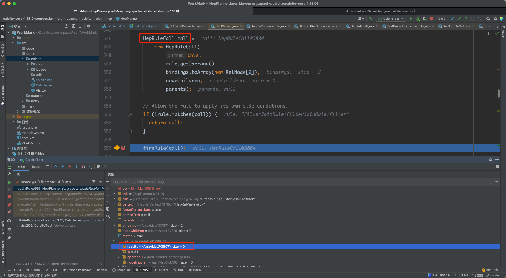 -fireRule(call)-> 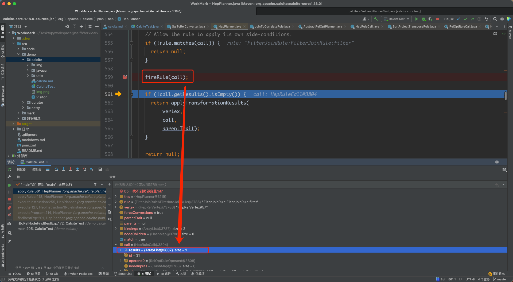

fireRule 方法我们只列举 onMatch() 的一个实现, 以 FilterIntoJoinRule 为例 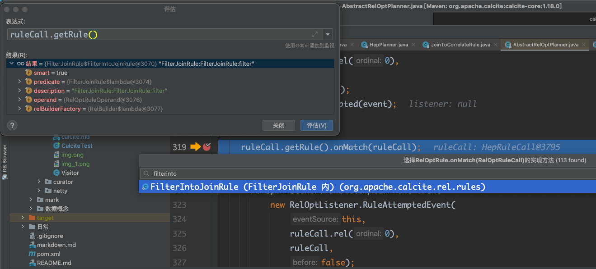

基于规则优化之后的对比: 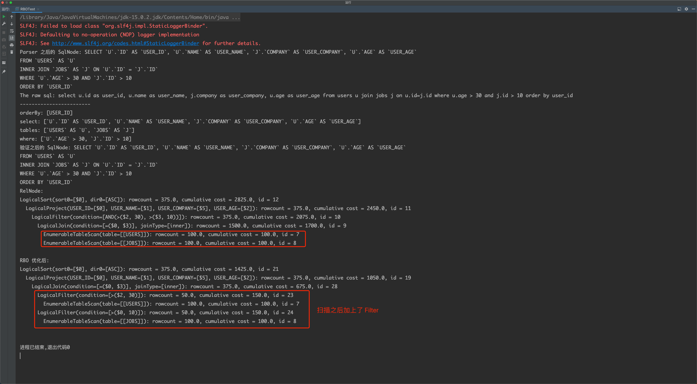

## 6.4 VolcanoPlanner

### 6.4.1 关于 CBO

有些时候仅有 RBO 还是不够的, 比如: A join B join C, A B 都是大表, C 是小表, 那明显就是 A join C join B 才是最优执行结果, 这种优化有什么规则么? 并没有, 而是需要计算 A join B join C 的成本 与 B join A join C 或其他的 join 方式的成本, 之后基于成本选择.

那么对于 CBO 我们要考虑的事情:
1. CBO 的原理是计算所有执行路径的成本, 之后选择最小成本的执行路径. 问题转化: **如何计算路径的成本**?
2. 想要知道路径的成本, 必然要知道每个算子的成本. 问题转化: **如何计算算子的成本**?
3. 想要知道算子的成本, 需要知道计算规则与参与计算集. 问题转化: **如何定义计算规则**? **如何计算中间结果**?
4. 上面说的计算规则其实是一种固定的规则, 可定义; 而中间结果则需要原始表的信息沿着语法树逐层推导. 问题转化: **如何知道原始表的基本信息与推到出中间表信息**?

带着问题, 我们整理出我们每步要做的目标:
1. 采集原始表基本信息.
2. 计算中间表基本信息.
3. 定义每种算子的代价计算规则, 结合中间表基本信息, 可以计算出算子的执行代价.
4. 遍历路径, 各个节点的算子执行代价之和就是路径执行代价.
5. 选择最小代价路径.

接下来以一条 sql 为例:
```sql
select * from A left join C on a.cid = c.id where c.id > 100;
```

#### 1.采集原始表基本信息
* estimatedSize: 每个 LogicalPlan 节点输出数据大小
* rowCount: 每个 LogicalPlan 节点输出数据总条数
* basicStats: 基本列信息, 包括列类型、Max、Min、number of nulls, number of distinct values, max column length, average column length等
* ... ...

* 为什么采集这些?
    * estimatedSize 与 rowCount 都是用于计算算子执行代价的两个重要信息.
* 如何采集? 一般有两种方案:
    * 所有表扫描一遍, 优点就是简单, 缺点就是大表不友好;
    * Analyze 命令, 也有优化, 比如数据没有大变动的场景就没必要执行, 再比如高峰期不执行等.

#### 2.计算中间表基本信息
我们有了原始表信息了, 现在如何计算中间表基本信息呢? 比如上面的 c.id > 100 的信息呢?

1. 对于均匀分布的场景, 其实只需要知道 id 的最大值最小值就可以取出 id>100 的比例了.
   1. 
   2. 注: 这里的 id 并不一定是真正的 id, 这个字段的关键是要体现均匀分布, 比如 1 2 3 4 ... 199 200, 这样的 id>100, 我们就知道代价是全表的一半 
2. 如果数据分布不均匀呢? 我们可以利用直方图
   1. 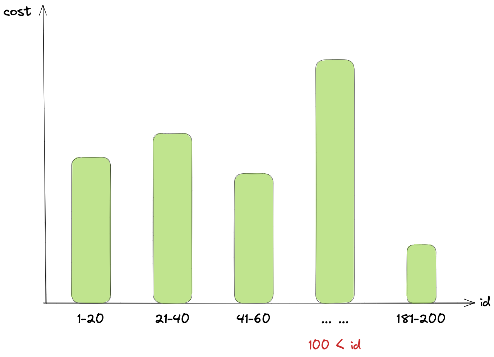
   2. cost(>100) / cost * id

#### 3.核心算子实际代价计算
一般来说, 代价基于两个维度来定义: CPU/IO, 但实际并不是仅有这两个,
* Table Scan算子: 数据条数 * 数据平均大小 * 从 HDFS 读取数据每单位所需要的代价; CPU IO 计算方式都是一样的;
* Hash Join算子: 哈希 join 包含两个过程: 建立阶段与探测阶段, 所以代价计算相比上面的复杂一些, 需要小表构建 table 的代价 + 大表探测的代价; CPU IO 需要分别计算;

无论哪种算子的代价计算, 都是和参与的条数, 数据大小等因素相关; 这些信息是从第二步计算出来的中间表信息中抽取来的.

#### 4.选择最优执行路径
基于图的算法, 这里省略

### 6.4.2 VolcanoPlanner 是如何实现的

`上面我们介绍了 CBO 的理论知识, 这里我们具体看 calcite 如何实现的`

官方的测试类 [VolcanoPlannerTest](https://github.com/apache/calcite/blob/b9c2099ea92a575084b55a206efc5dd341c0df62/core/src/test/java/org/apache/calcite/plan/volcano/VolcanoPlannerTest.java)

基于成本优化之后的对比: 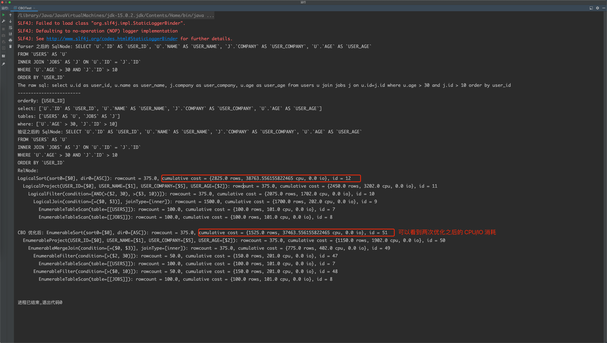