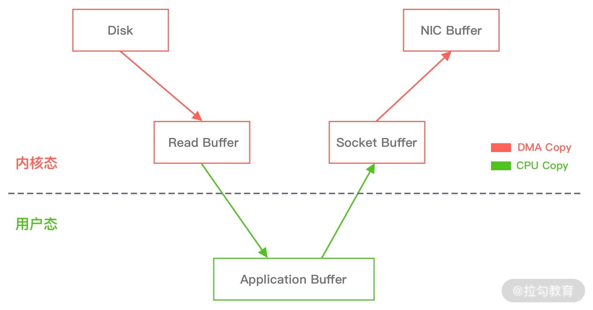

# IO

参考[美团技术团队](https://tech.meituan.com/2016/11/04/nio.html)

* IO 的过程分为 同步/异步 阻塞/非阻塞
    * 同步/异步: 指的是客户端是否需要等待服务端的响应.
    * 阻塞/非阻塞: 指的是单独一个线程内部资源如果没有准备好, 线程是否需要等待.

`那么我们从传统 IO 和线程池模型面临的问题开始, 逐渐解析 NIO 怎么利用 事件 模型来处理的, 包括面向事件的方式编写服务端/客户端程序`

## BIO

```
我们通过伪代码来描述一下传统的 同步阻塞 IO 模型:
ServerSocket serverSocket = new ServerSocket().bind(8080);
ExecutorService executor = Excutors.newFixedThreadPollExecutor(100);//线程池
while(!Thread.currentThread.isInturrupted()){//主线程死循环等待新连接到来
    Socket socket = serverSocket.accept();
    executor.submit(new Handler(socket));//为新的连接创建新的线程
}
class Handler extends Thread {
    private Socket socket;
    public ConnectIOnHandler(Socket socket){
       this.socket = socket;
    }
    public void run(){
        while(!Thread.currentThread.isInturrupted()&&!socket.isClosed()){
            String someThing = socket.read()....//读取数据
            if(someThing!=null){
                ......//处理数据
                socket.write()....//写数据
            }
        }
    }
}
```

BIO 是通过**多线程**来处理 socket.accept()、socket.read()、socket.write() 这三个主要函数都是同步阻塞的, BIO 没有能力知道 到底能不能读/写, 所以全程"傻等", 只能用多线程强行把
CPU 释放出来.

这个模型最本质的问题在于, 严重依赖线程. 依赖线程怎么了? 线程有什么特点? 线程是很"贵"的资源, 那么线程贵在哪?

1. 线程的创建和销毁成本高, 上面的伪代码是我们在 java 的基础上实现的, 如果我们把 java 对换成操作系统级别, 如果我们的 IO 处理过程不是一个 java 进程, 而是 Linux 操作系统, 线程本质就是进程,
   创建和销毁都是重量级的系统函数.
2. 线程占用较大的内存, 在 jdk1.5 之后, 每个线程占用 1M 的内存空间.
3. 线程切换成本很高, 因为线程切换还需要保留线程的上下文, 如果线程数过高, 可能执行线程切换的时间甚至大于线程执行的时间.

我们整理一下上面的同步阻塞 IO 过程, 可以拆分两件事件, 等待可读写, 真正执行读写. 换句话说, BIO 模型关心的是: 我要读写, 而 NIO 模型关心的是: 我可以读写.

## NIO

`传统的 IO 是对 stream 的操作, 而 NIO 则是对于 buffer(块) 的操作, 块放到通道被复用器选择完成 IO 过程`

* NIO 的设计原理:
    * 首先, 客户端与服务端是通过 channel 通信, NIO 可以在 channel 进行读写操作;
    * 其次, 将各个进程的 IO 操作注册到 selector(复用器)上, 单独注册额外的一个进程调用 select 监听所有的 channel, 任意 channel 可以进行 IO 时候, selector 会选择对应的 IO
      操作;
    * 主要概念:
        * Buffer: 传统的 BIO 是通过流(Stream) 完成的, 而 NIO 中所有的操作是在缓冲区完成的, 缓冲区实际是是个数组. 常见的有: ByteBuffer, CharBuffer,
          ShortBuffer, IntBuffer, LongBuffer, FloatBuffer, DoubleBuffer.
        * Channel: 和流不同, 通道是双向的, NIO 可以通过通道完成 读 写 以及同时读写. 通道分为两类: 网络读写, 文件读写.
        * 多路复用器 Selector: 主要提供 **已就绪则执行** 的操作, 方式是通过 Selector 不断的轮询注册在其中的 Channel.

## Netty

Netty 也是基于 NIO 的升级, 很多人会把 Netty 认为是 NIO 的封装, 其实不仅仅是, 因为 Netty 的作用是完整的网络通信, 比如说要处理的:

* 粘包拆包
    * 粘包: TCP 为了效率, 将多个缓冲区的数据一起发出.
    * 解决办法:
        * 消息固定长度
        * 明确消息边界
* Netty 的解决办法: 实现上面两个解决办法的对应解码器
* Netty 也实现了 Zero-copy, 那么 Z-copy 都会用到堆外内存, 那么 Netty 怎么管理的堆外内存

## 额外话: 零拷贝

`各种工具的 IO 零拷贝大多类似, 这里我们并不是单独解释 Netty 的零拷贝, 而是解释 IO 的零拷贝`

传统的 IO 拷贝过程是这样的, 从内核态到用户态再到内核态, 这期间会涉及多次上下文的切换 

具体多少次 怎么切换的, 不展开聊, 

Linux 中系统调用 sendfile() 可以实现将数据从一个文件描述符传输到另一个文件描述符, 从而实现了零拷贝技术. 
