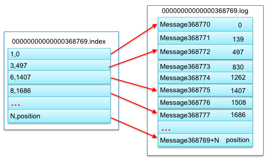

### kafka 如何保障可靠性与一致性

需要从两个方面讨论, 一个是架构层面, kafka 的实现, 一个是业务层面, 数据层如何保障消息的一致性

1. 可靠性
   `一条消息是如何保证从 producer -> kafka 之后不会丢失`

- kafka:
    - producer 如何保障一条消息存储到 kafka 中, 通过 ACK 参数配置:
        - ack=0: 生产者成功发出消息就认为是成功写入 kafka.
        - ack=1: 分区副本的 leader 收到消息, 才返回给生产者
        - ack=-1: 所有副本都向 leader 发送 ACK(也就是所有 follower 完成了同步), 才认为是成功写入.
    - kafka 内部, 如何保障一条消息的可靠性
        - 分区副本, 包含 leader & follower, **读写**操作必须在 leader 中进行, 同时 follower 会定时去 leader pull data. 这里 follower 并不是用户读的场景,
          仅仅用在 leader 挂掉的场景, follower 可以提供完整的数据.
    - 关于 leader 选举: **ISR**
        - 每个分区的 leader 维护了一个 ISR 列表, 这个列表保存了 follower 的编号, 只有 *跟得上* leader 的 follower 副本才能进入这个列表, 那么这个列表中的第一个才能被选举被最新的
          leader.
        - 关于上面提到的 _跟得上_ 的解释: 距离上次 FetchRequest 的时间小于阈值, 或者落后的数据大于阈值. 说白了就是: 最近有同步数据的操作.
            - replica.lag.time.max.ms=10000 # 如果 leader 发现 follower 超过10秒没有向它发起 fetch 请求，就从 ISR 列表剔除
            - replica.lag.max.messages=4000 # 相差 4000 条就移除
    - leader 选举需要注意的一个点: **不完全的leader 选举**
        - 在 broker 级别有个参数 unclean.leader.election.enable, 默认为 false, 单表: 禁止不完全的 leader 选举.
        - 意味着 leader 挂了, 但是此时 ISR 列表没有可选副本时, 是否允许某个不完全同步的副本成为 leader, 这有可能会导致数据丢失或者不一致. 所以金融场景禁用.
        - 任然离不开 **可用性** 与 **一致性** 的致命对决.

- 总结:
    - producer ack = -1
    - replication.factor >= 3 设置分区副本数
    - min.insync.replicas >= 2 保障 ISR 中至少 2 个分区副本,

2. 一致性
   `不论哪个副本, 都存在同样的数据`
   

- kafka: 假设分区配置的副本数为 3, 其中副本 0 是 leader, 副本 1 2 都是 follower, 并且在 ISR 列表中. 其中副本 0 已经写入一条消息, 但是 Consumer 只能读取到 Message2,
  是因为所有的 ISR 都只是同步到了 Message2, 只有 High water marker 以上的消息才会被消费, 而 HWM 取决于 ISR 列表里面偏移量最小的分区, 类似木桶原理.
- 这么设置的原因是因为: 没有被足够多的副本复制的消息被认为是不安全的, 如果 leader 崩溃, 另外的副本竞争, 有可能丢失数据. 比如: 一个消费者从副本 0 读取到了 Message4 然后 leader 挂了, 副本 1
  重新被选举出来当 leader, 这时候另外一个消费者去读取消息, 发现消息不存在, 则数据不一致.
- 当然引入 HWM 导致 broker 之间的消息复制变慢, 那么消息到达消费者的时间也增加.
- 数据:
    - 对账: 业务数据对账
    - 布隆过滤器

### kafka 为什么快

#### 顺序读写

不管是内存还是磁盘, 快慢的关键在于寻址方式, 内存与磁盘都包含 顺序与随机 读写, 随机都是比较慢的, 顺序较快, 甚至磁盘的顺序读写高于内存的随机读写. kafka 则是将每条消息插入到 Partition 的末尾.
这种设计的缺陷就是没有办法删除消息, 所以 kafka 是不会删除数据的, 每个消费者对于每个 topic 都记录着自己的 offset. 这个 offset 是保存在 zk 中的. 但是如果 kafka 完全不删除数据是不可能的,
提供两种策略来删除数据, 基于时间 或者 基于 Partition 文件大小.

#### Page Cache

为了优化读写性能, kafka 利用操作系统本身的 PageCache, 也就是利用操作系统本身的内存而不是 JVM 内存. 通过 PageCache, Kafka 的读写基本都是基于内存的.

#### 零拷贝

linux 操作系统的零拷贝机制使用了 sendFile 方法, 允许操作系统将数据从 PageCache 直接发送到网络. 原始: 磁盘 -> page cache -> 用户态缓存区 -> socket 缓冲区 -> NIC 缓冲区
零拷贝: 磁盘 -> page cache -> sendFile -> socket 缓冲区 -> NIC 缓冲区 不涉及用户态 Page Cache + sendFile 提供不错的性能, 这就是位色很么消费者在不断消费数据的过程中,
是不会将 IO 磁盘打满的.

#### 分区分段 与 索引
kafka 的架构为: 集群 -> borker -> topic -> partition -> 副本 -> segment -> .index/.log

最终逻辑就是 consumer 传过来 offset, offset 在 index 文件中查找消息索引, 再来到 log 文件找到具体消息.
同时 segment 也带来一个特点, 容易清除已消费完的文件, 减少磁盘用量.

#### 批量读写 与 压缩

1. kafka 的数据读写的是批量的而不是单条的.
2. 有时候瓶颈并不是CPU 或者 磁盘 IO 而是网络 IO. kafka 就是将批量的消息通过压缩的形式发送, 支持多种压缩协议.

### kafka 集群

`kafka 使用 zk 来维护 brokers 的信息. 每个 broker 都有一个唯一表示 broker.id.`

* 每个 broker 启动的时候, 会在 zk /brokers/ids 路径下创建一个临时节点, 将自己的 brokerId 写入. 完成注册过程
* 所有 broker 竞争在 zk 上创建 /controller 节点, 由于 zk 的唯一节点, 必然只有一个 broker 创建成功, 这个成为 controller broker. 额外负责管理分区与副本状态.
* 当 broker 宕机时, 触发 zk 的 watcher 事件, 如果宕机的是 controller broker 时, 还会触发新的 controller 选举.

### 副本机制

topic 下有多个分区, 分区是 kafka 最基本的存储单元. 每个分区可以有多个副本, 其中一个副本是 leader

### 消息顺序

kafka 只能保障单独分区内的消息顺序, 不能跨分区保障消息顺序.

### kafka 的数据事务

事务包含三个级别

1. 最多一次: 消息不会重复发送, 但也可能一次也不发送
2. 最少一次: 消息至少发送一次, 有可能重复
3. 精准一次: 不多不少.