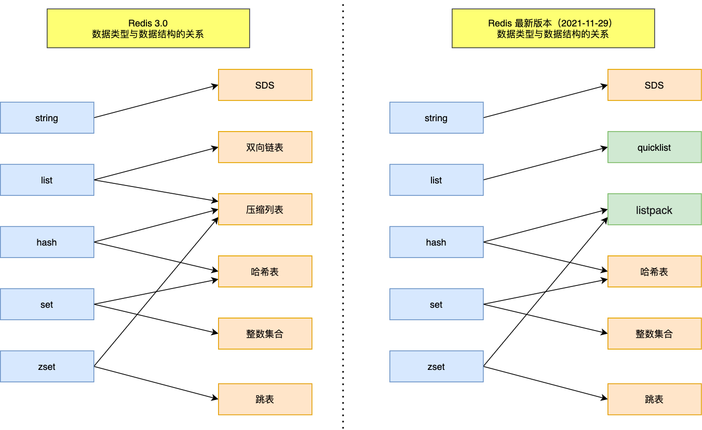
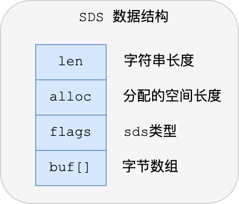
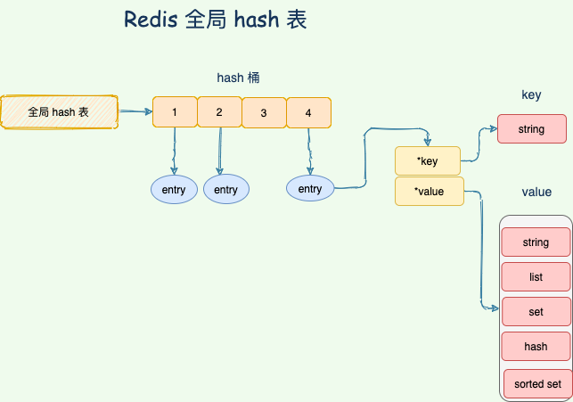

# 核心问题: Redis 为什么快?

`KV 内存 单线程? 别忘了数据结构`
`单机 10w QPS`

## 基于内存

## 数据类型

1. String
2. List: 消息队列, 列表场景
3. Set
4. Hash
5. SortedSet

## 数据结构

**⚠️⚠️⚠️ 写在最前, 数据结构不同于数据类型, 在 Redis 中, 这些数据类型的实现是由多重数据结构组合完成的, 不要把结构和类型混为一谈**

`基本上我们就是 9 种数据结构, SDS zpiList quickList linkedList hash...`

1. String: SDS 简单动态字符串
    1. 
    2. 除了字符串本身, 还保存了额外信息, 比如 len, free
    3. 空间预分配, SDS 被修改后, 除了分配必须空间, 还会分配额外空间
    4. 惰性空间释放, 对 SDS 缩短, 并不会回收多余的内存, 而是使用 free 来保存这些空间不释放, 之后如果 append 则直接使用 free 中的空间
    5. 两种编码格式, embStr/raw 编码, 根据字符串长度选择, 默认使用 embStr 为了占用连续内存.
2. zipList:
    1. 本质是通过字节数组实现的, 为什么用数组实现链表? 是因为我们一般实现链表都会使用到指针, 这样会占据额外的内存空间, 引起内存碎片, 所以使用数组占用完整的一块内存.
    2. 缺点就是担心连锁更新的可能. 所以适用于少量数据的场景.
    3. 是 list hash sortedSet 类型的底层实现结构之一.
3. zipList 之后的升级: quickList 和 listPack
    1. quickList
    2. 
    3. 是 zipList + linkedList 的合体
4. 哈希表
5. skipList 跳表, 为了时间复杂度: O(logN)
    1. 
    2. 有序 层级的数据结构, 增加多层级索引, 通过索引位置的几次跳转, 实现数据的快速定位
    3. 比如 12345, 第一层保存 1, 第二层保存 134, 第三层保存 12345, 然后每个节点都保存着相邻的指针
    4. 同时, 各个节点之间, 保存了一个属性, 叫 跨度. 来保存节点之间的距离.

## 单线程模型

1. 单线程**仅仅**是指 KV 读写的过程是单线程的.
2. 越是读写快(利用内存)的场景, I/O 越快, 多线程模型越是不利.

## I/O 多路复用

epoll 模型是基于事件驱动, 利用多路复用的特性, 减少在等待 I/O 处理时的时间.

## Redis 的 KV 模型

## 持久化

`RDB AOF`

1. RDB 是快照的形式，完成数据的备份据保存到 *.rdb 文件中，这个文件是个二进制文件。
    1. RDB 的实现策略有两种形式, save 与 bgSave(backgroundSave).
    2. bgSave 的实现方式: 当需要持久化时, fork 一个子进程, 新的进程负责全程的写入, 之后替换掉原来的 rdb 文件. 实现 copy-on-write.
2. AOF 是把所有对 Redis 的修改的命令都存到一个文件里，当持久化的时候读取的时候这个文件。
    1. AOF 同步有三种策略, yes always(数据变更则同步) everySec(指定秒数同步).
    2. AOF 的缺点就是文件较大, 上面的 rdb 只是一个二进制文件, 但是 AOF 则是一个文件内保存了较多的字符串.

## 数据清理策略

1. 惰性删除(获取时候判断是否需要删除)(主要目标是节省 CPU 资源, 因为是单线程的, 但是非常浪费内存) + 定时删除(解决惰性删除浪费内存的问题)

## 淘汰机制

1. 一共 8 种可以聚合分为 4 种, LRU(最少使用) 最小频率 随机 TTL

## 分布式锁

1. 先了解 set
    1. setEx: set expire key, 有过期时间
    2. setNx: set not exist, 有返回值的 set key
2. 看业务场景, 不重要的应用可以使用 redis 实现
    1. setNx
    2. expire key
    3. delete key
    4. 后来 redis 也有新的命令, set key value ex px nx, ex: expire, px: 毫秒 nx: 键 notExist 时存入, xx: 键 existExist 时存入, 就是把一堆 set
       命令变成了一次 pipeline 操作
    5. 至于 什么 lua 脚本的, 就扯淡了, 建议直接换 zookeeper 或者 etcd

## 雪崩 穿透 击穿

1. 雪崩：所有 key 的失效时间都是 12 小时，那如果这时候来了大量请求，相当于 redis 什么作用都没有。
    1. 设置 key 失效时间都加个随机值
    2. 既然跟 key 失效有关，那我 key 不失效不就得了，去主动更新 redis 的数据而不是用 redis 自动失效
2. 穿透：缓存与数据库中都没有的数据，但是用户还在不断地请求。像这种穿透了 redis 去给 mysql 压力，就叫穿透。
    1. 参数校验
3. 一个 key 非常热点，不停的扛着大并发，当这一个 key 失效瞬间，就是大量的请求都到了我数据库
    1. 可以自己服务端缓存, 利用 Redis 的消息通知, 把 Redis 的服务端数据同步给客户端, 同样包含变更操作.