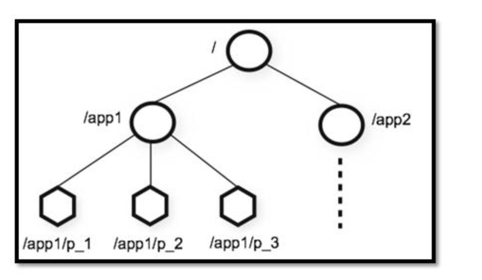

## Zookeeper 中的概念
1. 整体模型 
   1. 多叉树模型, 在每个节点保存数据
   2. 注意, zookeeper 只是用于协调, 并不是纯粹的数据库, 所以每个节点限制了存储数据量的大小为 1M
2. znode, 单个节点
   1. zookeeper 中的最小单元
   2. 持久/临时 是相对 客户端与 服务端 断连 之后的存储状态
   3. 有 4 种类型, 持久 临时 持久顺序 临时顺序, 这个单独解释下顺序, 比如 /node1/app0000000001 /node1/app0000000002
   4. 每个 znode 包含两个属性, stat:状态信息 data:业务内容
3. znode 的 ACL 权限, 类似 Unix 文件操作权限
   1. 增删改查 以及 Admin
4. watch 功能
   1. zookeeper 生成 watcher, 返回给客户端, 发生变化回调给客户端.
5. zk 选举
   1. 概念:
      1. serverId: 服务 id
      2. zxId: 事务 id, 每个更新请求会升级一次 zxId
      3. 在选举过程中, 优先投票给 zxId 大的 server, 并且更新自己的事务.
   2. 角色:
      1. leader
      2. follower: 参与选举
      3. observer: 不参与选举, 只是为了提高读取速度
   3. 状态
      1. LOOKING: 竞选状态.
      2. FOLLOWING: 随从状态. 同步 leader 状态, 参与投票
      3. OBSERVING: 观察状态. 同步 leader 状态, 不参与投票
      4. LEADING: 领导状态.
   4. 为什么 2n+1, 以及脑裂的处理
      1. 如果网络分区, 剩余存活节点必须大于 n/2 才能组成集群, 
      2. 比如 7 个节点, 分区成了 4 + 3 两个分区, 那么 3 那个分区是没有办法成为集群的, 因为 3 不大于 7/2 = 3
      3. 比如 6 个节点, 意味着最多只能挂掉 2 个, 如果挂了 3 个, 那么剩余 3 个不大于 6/2, 所以都无法成为集群.
   5. 选举过程: 比如 1-5 五台物理机部署 zk 集群, 那么依次启动
      1. 1 启动, 但是只有一台, 发出去的报文没有响应, 所以处于 LOOKING 状态.
      2. 2 启动, 与 1 交互, id 大的胜出, 但是没有过半的服务器选举, 所以仍然是 LOOKING 状态.
      3. 3 启动, 目前 id 最大, 成为 leader
      4. 4 启动, 已有 leader, 所以 4 也为 follower
      5. 5 同理
      6. 如果反过来, 5 4 3 2 1 启动, 5 为 leader