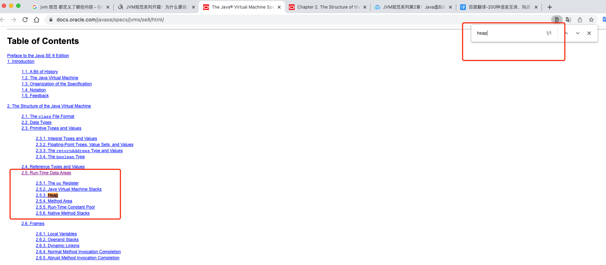

1. 在 [Java Virtual Machine Specification](https://docs.oracle.com/javase/specs/jvms/se8/html/) 中, 搜索 heap, 就会发现 
2. 在第二章, 有一个 Run-Time Data Areas, 其中定义了:
   1. The pc(program counter) Register(程序计数器) 
   2. Java Virtual Machine Stacks(JVM 栈)
   3. Heap(堆)
   4. Method Area(方法区)
   5. Run-Time Constant Pool(运行时常量池)
   6. Native Method Stacks(本地方法栈)
3. 到这, 可能很多人懵了, 诶, 怎么定义了 6 个区域呢, 网上明明写着 5 个呢
   1. 因为这个运行时常量池是保存在方法区中的, 所以很多人都用方法区来概括这个运行时常量池
4. 那规范由 Oracle 定义了, 总得实现这套规范, 谁实现的呢? **HotSpot**
5. 而我们说的这些 永久代 老年代 这些, 都是 HotSpot 的实现. 不要和 JVM 虚拟机规范混为一谈.
6. JVM 中定义的 方法区 在 HotSpot 的实现中, jdk1.7 是通过永久代来实现的, jdk1.8 废除永久代使用元空间来实现.
7. HotSpot 如何实现 JVM 规范:
   1. 堆区: HotSpot 使用新生代 老年代来实现堆区, 
   2. 方法区
   3. JVM 栈
   4. 程序计数器
   5. 本地方法栈
8. HotSpot 除了上面这些, 还有对 Class 加载的实现, 我们常说的 加载过程 和 双亲委派模型就是在这里实现的:
   1. 加载过程
   2. 双亲委派模型
9. 还有 