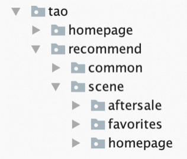
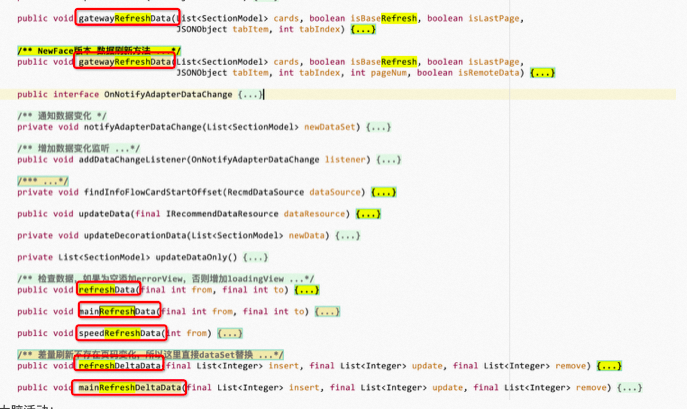

`你可不能像给狗狗取名字那样给类、方法、变量命名。仅仅因为它很可爱或者听上去不错。这里我们仅谈 类 方法 变量等，而不是 Java Hadoop Kafka 这样的命名...`

`在写代码的时候，你要经常想着，那个最终维护你代码的人可能将是一个有暴力倾向的疯子，并且他还知道你住在哪里。`

# Part I 为什么命名很重要？

在一次项目中，从项目的创建，到项目的落地实现，看上去任何一小步都是以命名为**起点**，比如：我们要为项目起一个名字、我们要为变量、参数、方法、类命名。 这些名字出现在代码的每个角落，**无处不在**
，混乱或错误的命名不仅让我们对代码难以理解，更糟糕的是，会误导我们的思维，导致对代码的理解完全错误。 如果整个项目始终贯穿着好的命名，就能给阅读者一个神清气爽的开始，也能给阅读者一个好地**指引**。

要知道，代码的**阅读**次数远远多于编写的次数。请确保你所取的名字更侧重于阅读方便而不是编写方便。

# Part II 为什么很难正确命名？

有人称编程中**最难**的事情就是命名。 抛开环境搭建，真正到了编码阶段第一件事就是命名，而最常见的一种情况，就是毫无目的、仅凭个人的喜好的去决定了一个名字。
但因为没有想清楚目标和具体实施步骤，所以进行过程中往往会面临无数次的小重构甚至是推倒重来。

#### 1.缺乏意愿

担心在命名这件事情上花费时间，没有一个意愿想要做好命名这件事，随心所欲，甚至无视团队对命名的基本规范要求，觉得编译器能通过，代码可以正常运行即可。

其实对发现的命名问题进行重构和推倒重来并不可怕，最可怕的是当下程序员不具备发现问题后肯回过头来纠偏的意愿。这终将演变成为一场灾难。

#### 2.缺乏思考

没想清楚被命名的事物是什么，事物应该承担什么职责，是否会对其他人造成误解。

新手程序员总会花很多时间学习一门编程语言、代码语法、技术和工具。他们觉得如果掌握了这些东西，就能成为一个好程序员。 然而事实并不是这样，或者说并不仅仅是这样；编程不仅仅关乎掌握技能和工具，更重要的是在特定范畴内**解决问题**
的能力，还有和其他程序员**合作**的能力。 因此，能在代码中准确的表达自己的想法就变得非常重要，代码中最直观的表达方式是命名，其次是**注释**。

#### 3.缺乏技巧

选一个好的名字真很难，你可能得有较高的**描述能力**和共同的文化背景。并且知晓一些常见且应该避免的命名问题。

如果最终还是没法找到合适的名字，还请添加准确的**注释**辅助他人理解，等想到合适的名字后再进行替换，不过往往能够通过注释描述清楚的事物，命名应该问题不大。 问题大的是连注释都无法准确表达，那说明可能当前类、函数、变量承担的职责太多太杂。

#### 4.缺乏底线

就像上面描述的那样，"问题大的是连注释都无法准确表达" 这就说明这个方法的设计或实现有问题，或者你需要更多的上下文来解决问题。

在编程中，编写高质量的代码是至关重要的，这包括遵循最佳实践和设计模式，以确保代码的可维护性和可扩展性。缺乏底线的方法我们只说在命名这个场景下存在的问题，就是增加命名的复杂度，以至于无法命名。

# Part III 如何正确的命名？

`这里不讨论具体语言的命名规则，原因是不同编程语言命名规则各不相同，甚至不同团队间相同语言的命名规则也有出入。这里主要从提高可读性出发，以 Java 作为演示语言，给一些关于命名的建议。`

#### 1.名副其实

无论是变量、方法、或者类，在看到他名称的时候应该答复了阅读者所有的大问题；它应该告诉你：它为什么会存在，它做什么事，怎么做。 如果在看到名称时，还需要去查找注释来确认自己的理解，那就不算名副其实。而且在发现有更好的命名时，记得果断替换。

原代码：

```java
public interface OnRequestListener {
    /**
     * 请求结束 只有成功点才认为是真正的结束
     */
    void onRequestEnd(....);

    /**
     * 请求开始
     */
    void onRequestStart(...);
}
```

思考历程： onRequestEnd 是请求的什么阶段？请求成功和失败任意情况都算 end 吗？看下注释，原来注释有写："只有成功点才认为是真正的结束"。

修改代码：

```java
public interface OnRequestListener {
    void onStart(....);

    void onSuccess(....);

    void onFailure(...);
}
```

#### 2.避免误导

`在每种语言中都有内置的标识符，他们都有特定的含义，如果和他们没有关联就不要在命名中加上他们。`

##### Case1：命错名的集合

原代码：

```java
private List<Xxx> dataSet;
```

思考历程：返回值是个 List，但是变量名包含个 Set，那到底是 Set 还是 List？跟踪下历史代码，将返回值与变量名统一。

修改代码：

```java
private List<Xxx> dataList;
```

##### Case2：类名烟雾弹

原代码：

```java
/** 作者+日期 */
public class XxxResponse {
}

/** 作者+日期 */
public class NXxxResponse {
}
```

思考历程：嗯？两个类，一个 XxxResponse 一个 NXxxResponse，N 是什么意思？new？看名字像是个应答类。结合一下历史背景，隶属于两套流程。

修改代码：

```java
// 调整到对应业务场景的包下
public class XxxResponse {
}

// 调整到对应业务场景的包下，适当注释
public class NXxxResponse {
}
```

##### Case3：整形变量为啥要用is开头

原代码：

```java
private int isFirstEnter = 0;
```

思考历程：为什么 "is" 开头的变量却声明成整形？到底是要计数还是判断真假呢？看下关于变量的逻辑，确认下。

修改代码：

```java
private boolean isFirstEnter = true;
```

##### Case4：开关作用反掉啦

原代码：

```java
// 从配置中读取 delay 属性
if (config.getBooleanValue(delay)) {
    normalHandle();
} else {
    delayedHandle();
}
```

思考历程：为什么开关 delay 为 false 的时候，走的才是 delay 逻辑，那开关要怎么发？容我多看几遍，是不是最近没休息好看岔了。

修改代码：

```java
// 从配置中读取 delay 属性
if (config.getBooleanValue(delay)) {
    delayedHandle();
} else {
    normalHandle();
}
```

#### 3.做有意义的区分

`如果单纯只是为了区分两个名称不能一样，就使用就使用诸如数字，字母来做区分的话，那似乎是毫无意义的区分。`

##### 3.1.避免在名字中使用数字

原代码：

思考历程：2、3、4难道是因为首页历史包袱太沉重，推荐迭代的版本实在太多导致 Old、New、New Plus 单词不够用所以用数字来代替新旧 4 个历史阶段的版本吗？事实上这些包属于母包下不同的业务场景。

修改代码：

##### 3.2.避免使用具有相似含义的名字

原代码：

思考历程：一个类中存在 7 个 refresh 方法，任意两个的区别是什么？

修改代码：实际上这已经不是一个单纯优化命名可以解决的问题，无论叫的多具体，面对7个刷新接口都会懵圈。期望在方法声明期间，作者多体量后来的阅读者和维护者，及时的调整代码。

后来者可以从实际出发去假存真，做减法干掉其它无用的6个刷新方法保留一个刷新接口。

##### 3.3.避免使用具有不同含义但却有相似名字的变量

原代码：

```java
public void showOverlay(@NonNull View view) {
    View rootView = getRootView(view);
    DxOverlayViewWidget dView = createDxOverlayViewWidget();
    dView.showOverLayer(view.getContext(), (ViewGroup)rootView, cardData, itemData);
}
```

思考历程：整个方法中有三个以 view 结尾的变量，且区分度很小，在后续调用过程中，会让人抓狂。

修改代码：

```java
public void showOverlay(@NonNull View hostView) {
    // 将变量赋予业务意义
    ViewGroup parentView = getParentView(hostView);
    DxOverlayViewWidget dxOverlayViewWidget = createDxOverlayViewWidget();
    dxOverlayViewWidget.showOverLayer(hostView.getContext(), parentView, ...);
}
```

#### 4.使用读得出来的名称

`使用已有词汇，而不是自造词，这会在：无论是记忆、或者是讨论时，都能带来便利。可以使用达成共识的缩写，避免造成阅读障碍。`

##### Case1：接口定义中的俏皮缩写

原代码：

```java
public interface IR4UDataSource {
  ....
}
```

思考历程：什么是 IR4U？是否和某个包名有联系？原来 R4U 是 Recommend For You 的俏皮写法。

修改代码：

```java
public interface IRecommendForYouDataSource {
  ....
}
```

##### Case2：成员变量命名的缩写

原代码：

```java
private CreateJobOutputRequest cjr;
private UpdateJobOutputRequest ujr;
```

思考历程：cjr ujr 都是什么？同样是要浪费时间在寻找线索上。

修改代码：

```java
private CreateJobOutputRequest createJobOutputRequest;
private UpdateJobOutputRequest updateJobOutputRequestjr;
```

##### Case3：局部变量命名的缩写

原代码：

```java
for (PageParams.GroupBuckets ss:params.groupBucketIds.values()) {
    if (ss != null) {
        bucketIds.removeAll(ss.bucketIdsAll);
        Collections.addAll(bucketIds, ss.currentBucketIds);
        ...
    }
}
```

思考历程：在之后如果有再次用到 ss 这个变量的时候，包括深入到调用的方法里，是非常令人崩溃的。

修改代码：

```java
for (PageParams.GroupBuckets groupBuckets:params.groupBucketIds.values()) {
    if (groupBuckets!=null) {
        ....
    }
}
```

#### 5.使用可搜索的名称

`若变量或常量可能在代码中多处使用，则应赋其以便于搜索的名称。比如：魔法值的问题除了看不懂还有一个是无法搜索。`

##### 5.1 给魔法值赐名

原代码：

```java
public static void updateImmersiveStatusBar(Context context) {
    ....
    if (TextUtils.equals(isFestivalOn, "1")) {
        if (TextUtils.equals(navStyle, "0") || TextUtils.equals(navStyle, "1")) {
            ....
        } else if (TextUtils.equals(navStyle, "2")) {
            ....
        }
    }
    ....
}

```

思考历程：

1. TextUtils.equals(isFestivalOn, "1") 这个方法由于有 isXxxOn 的原因，推断这个 "1" 有可能是用于开关。
2. 那 TextUtils.equals(navStyle, "0"/"1"/"2") 中的 "0"，"1"，"2" 我该如何知道代表什么意思？

修改代码：

```java
public static final String FESTIVAL_ON="1";
public static final String NAV_STYLE_FESTIVAL="0";
public static final String NAV_STYLE_SKIN="1";
public static final String NAV_STYLE_DARK="2";

public static void updateImmersiveStatusBar(Context context) {
    ....
    if (TextUtils.equals(isFestivalOn, FESTIVAL_ON)) {
        if (TextUtils.equals(navStyle, NAV_STYLE_FESTIVAL) || TextUtils.equals(navStyle, NAV_STYLE_SKIN)) {
            ....
        } else if (TextUtils.equals(navStyle, NAV_STYLE_DARK)) {
            ....
        }
    }
    ....
}
```

##### 5.2 避免在名字中拼错单词

原代码：

```java
public interface Xxx {
    void destory();
}

```

思考历程：拼写错误，typo

修改代码：

```java
public interface Xxx {
    void destroy();
}

```

#### 6.类的命名

应该总是名词在最后面，名词决定了这个类代表什么，前面的部分都是用于修饰这个名词；比如，假如现在你有一个服务，然后又是一个关于订单的服务，那就可以命名为 OrderService，这样命名就是告诉我们这是一个服务，然后是一个订单服务；再比如
CancelOrderCommand，看到这个我们就知道这是一个 Command，即命令，然后是什么命令呢？就是一个取消订单的命令，CancelOrder 表示取消订单。

类的命名可以参考前面讲述过的规则。实际上往往了解一个类更多需要通过查看类的方法定义，而仅仅通过类名无法知晓类是如何工作的。

#### 7.方法的命名

可以用一个较强的动词带目标的形式。一个方法往往是对某一目标进行操作，名字应该反映出这个操作过程是干什么的，而对某一目标进行操作则意味着我们应该使用动宾词组。比如：addOrder()。

当方法有返回值的时候，方法应该用它所返回的值命名，比如currentPenColor()。

《代码大全》：变量名称的最佳长度是 9 到 15 个字母，方法往往比变量要复杂，因而其名字也要长些。有学者认为恰当的长度是 20 到 35 个字母。但是，一般来说 15 到 20 个字母可能更现实一些，不过有些名称可能有时要比它长。

##### 7.1 避免对方法使用无意义或者模棱两可的动词

避免无意义或者模棱两可的动词。有些动词很灵活，可以有任何意义，比如 HandleData()，processInput() 等方法并没有告诉你它是作什么的。这些名字最多告诉你，它们正在进行一些与计算或输入等有关的处理。

所用的动词意义模糊是由于方法本身要做的工作太模糊。方法存在着功能不清的缺陷，其名字模糊只不过是个标志而已。如果是这种情况，最好的解决办法是重新构造这个方法，弄清它们的功能，从而使它们有一个清楚的、精确描述其功能的名字。

###### Case1: 名不副实的 process

原代码：

```java
private boolean processMainPic() {
    ....
    boolean hasFloatPic = false;
    ....
    return hasFloatPic;
}

// 调用处
boolean hasMainPicFloat = processMainPic();
```

思考历程：

1. 方法名叫：处理主图
2. 返回值是 boolean，表示 处理成功/失败 么？
3. 方法内部，明明方法名叫处理主图，怎么里面是判断浮层图？
4. 最终结论：方法名与实际处理不符；同时 float 有浮点型的意思，隐含冲突。

修改代码：

```java
private boolean hasFloatData ($MainPictureData) {
    ....
    boolean hasFloatData = false;
    ....
    return hasFloatData;
}

// 调用处
boolean hasFloatData = hasFloatData(mainPictureData);

```

###### Case2: 我该如何正确使用这个方法

原代码：

```java
// 10 余处调用
...=Utils.processTime(System.currentTimeMillis());

public class Utils {

    public static long processTime(long time) {
        return time + (SDKUtils.getTimeOffset() * 1000L);
    }

}
```

思考历程：

1. 比如有一个工具类，其中有一个处理时间的方法，这个方法存在十余处调用。
2. 方法名不能做到见名知意，调用者在不查看具体代码时无法知道这个方法的意图。
3. 如果入参传入的不是 System.currentTimeMillis() 而是 SystemClock.uptimeMillis() 或者随意传入一个long值，方法的返回值会是什么呢？
4. 首先修改方法名做到见名知意；其次对于业务可以不传递的参数就减少多余参数传递，由方法内部自行实现。

修改代码：

```java
public static long currentNetworkTime() {
    return System.currentTimeMillis() + (SDKUtils.getTimeOffset() * 1000L);
}

```

##### 7.2 避免返回和方法名定义不一致的类型

原代码：

```java

// 假如 checkActivityAvailable 是唯一调用处
final IPageProvider pageProvider = checkActivityAvailable();
if (pageProvider == null) {
    ....
    return;
}

// 函数声明
private IPageProvider checkActivityAvailable() {
    IPageProvider pageProvider = pageProviderWeakReference.get();
    if (pageProvider == null) {
        PopFactory.destroyPopCenter(pageName);
        return null;
    }
    return pageProvider;
}
```

思考历程：

1. check 方法如果有返回值的话不应该是 bool 类型吗？
2. 那目前的返回值 IPageProvider 又是什么作用？
3. 查看 check 方法，发现里面有对变量的操作。那么就可以对应修改，比如：修改方法名，或者因为只是唯一调用处，删除这个方法重新整理代码也可以。

修改代码：

```java
final IPageProvider pageProvider = pageProviderWeakReference.get();
if (pageProvider == null) {
    PopFactory.destroyPopCenter(pageName);
    ....
    return;
}

```

# Part IV 养成良好地命名习惯一些建议

1. 对自己严格**自律**，自己写代码时要有一种希望把每个名称都命名好的强烈意识和严格的自律意识；
2. 要努力分析和思考当前被你命名的事物或逻辑的**本质**；这点非常关键，思考不深入，就会导致最后对这个事物的命名错误，因为你还没想清楚被你命名的事物是个什么东西；
3. 你的任何一个属性的名字都要和其实际所代表的**含义**一致；你的任何一个方法所做的事情都要和该方法的名字的含义一致；
4. 要让你的程序的每个相似的地方的命名**风格**总是一致的。不要一会儿大写，一会儿小写；一会儿全称一会儿简写；一会儿帕斯卡(Pascal)命名法，一会儿骆驼(Camel)命名法或匈牙利命名法；

# Part V 命名工具
1. <https://fanyi.phpstudyhelper.com/>
2. <https://unbug.github.io/codelf/>
3. 但是命名真正的核心问题并不是如何翻译的问题

# Part VI 参考

[阿里云](https://mp.weixin.qq.com/s/hHsuPsm2CQaXiuB5Lsio3w)